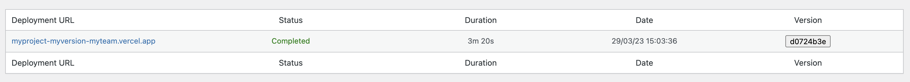

<h1 align="center">Wordpress Vercel Builds</h1>
<br />
<p align="center">
    <p align="center">
        Are we there yet?
    </p>
    <div style="display:flex;justify-content:space-between;align-items:center;">
        
        
        
        
        
    </div>
    <br />
    <a href="https://github.com/TimeZHero/wp-vercel-builds">
        
    </a>
</p>


## Install

1. Add the following into your composer.json `repositories` key

```
{ 
    "type": "github", 
    "url": "https://github.com/TimeZHero/wp-vercel-builds" 
}
```

2. Run `composer require "timezhero/vercel-builds"`
3. Configure a Vercel webhook pointing to `https://yoursite.com/wp-json/builds/update`
4. Define a constant `VERCEL_SIGNATURE_KEY` with the key provided by Vercel
5. Activate the plugin and check out your dashboard tab

## Hooks
1. `vercel_builds_capability`, to set the capability to view the build dashboard. The badge will be viewable to anyone. default: manage_options

## If you have multiple Vercel projects

Vercel currently has a limit of 20 configurable webhooks, which may not be enough for all your projects and environments. You can work around it by setting up a Lambda function on AWS (or equivalent) as the general webhook receiver for all your projects and proxy the request to the correct server.

A `lambda.mjs` file is included in the repo as an example of a possible implementation, but don't forget to:
1. Configure the environment variable `VERCEL_SIGNATURE` with the value provided by Vercel
2. Review the configuration array with all your projects and environments

## Contents
1. Polling on badge to quickly know the state of the latest build
2. Can view builds, with their status, date and duration
3. Customer-side debugging is possible by reviewing previous versions from the url
4. The commit SHA is included to help spot any regression bug

## Roadmap
2. Add a button to allow the customer to pin a previous deployment as production
3. Include customer-friendly build logging in case of failure. May help when the issue is located in the Frontend application
4. Someday, refactor for better code
